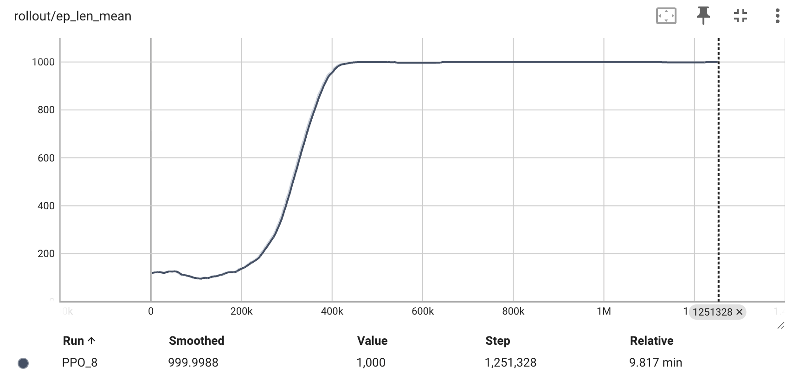
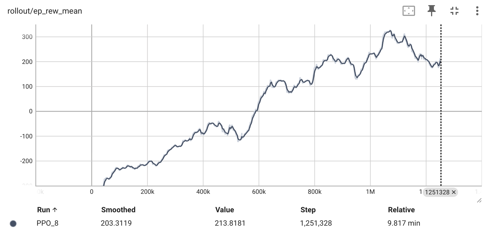
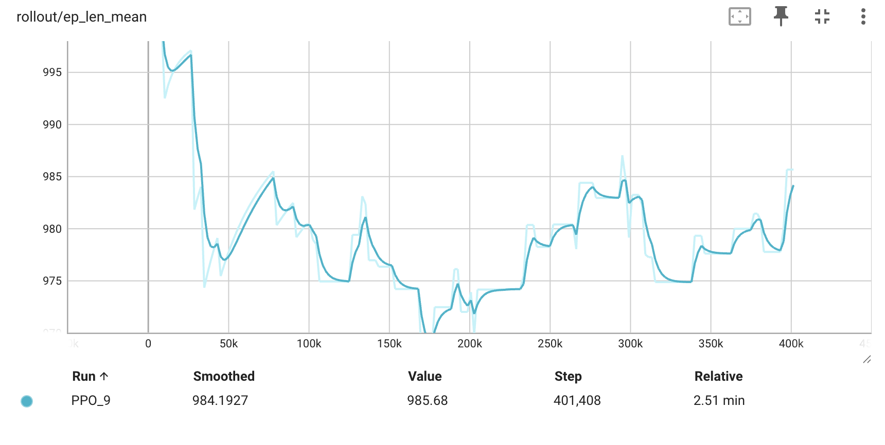
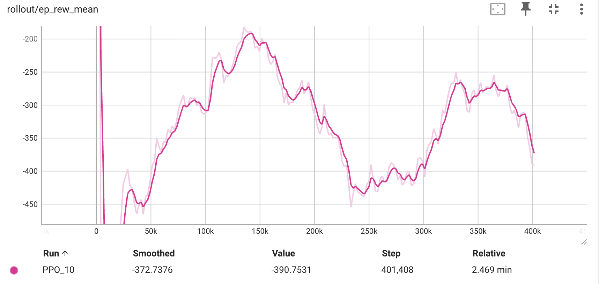
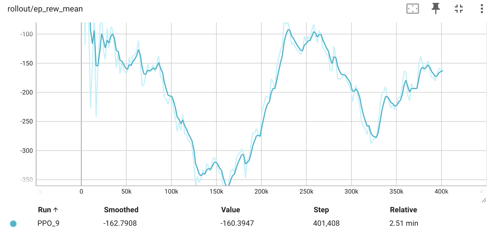

# Self-Level Platform

*A self-leveling drone platform that learns to recover from disturbances using reinforcement learning, running on custom embedded firmware.*

Solo, full-stack project spanning RL training in simulation through firmware deployment on real embedded hardware — built as a flagship project for ML engineering and embedded/firmware/systems roles.

**Status: not yet flying.** Sensor read + on-device inference are verified on real hardware at 200 Hz. Motor/ESC output and the tethered free-float demo are the remaining milestones.

---

## What it does

The platform is a 4-motor, drone-style rig that, when tilted or shoved, damps its motion and returns to level. It does **not** try to hold a fixed height or horizontal position — that's a deliberate design choice ("Free Float"), not a missing feature:

- Horizontal velocity (`vx`, `vy`) isn't observable with an IMU alone, and 4 vertical-thrust-only motors can't correct horizontal drift regardless.
- Rather than fake position-holding with information the hardware doesn't have, the reward function only penalizes tilt, vertical velocity, and angular rate — no height-error term. `vz` is the sole vertical-motion penalty and can't be dropped from the observation.
- Residual horizontal motion is left to decay via air resistance, same as it would in free flight. A tether is the honest real-world stand-in for that residual drift during bench testing.

A PPO policy trained entirely in PyBullet simulation is exported and re-implemented as a hand-written C forward pass running directly on the target microcontroller — no ONNX runtime, no NPU, no OS-level ML framework.

## Architecture

```
[PyBullet + Gymnasium simulation]
        │  PPO training (Stable-Baselines3)
        ▼
[trained policy .zip] ──export_weights.py──▶ [policy_weights.h — const float C arrays]
                                                        │
                                                        ▼
                                    Zephyr RTOS / nRF Connect SDK v3.3.0
                                    nRF54LM20 DK — Cortex-M33
                                    200 Hz k_timer control loop:
                                      IMU read → build obs[6] → policy_forward() → action[4]
```

| Layer | Tech |
|---|---|
| RL training | PyBullet + Gymnasium, Stable-Baselines3 PPO |
| Policy | 6 → 64 → 64 → 4 MLP, tanh, ~4,900 weights |
| Observation | `[height, vz, roll, pitch, roll_rate, pitch_rate]` — IMU-only, matches exactly what the real hardware can measure |
| Action | 4 normalized motor thrusts, `[0, 1]` |
| On-device inference | Hand-written C forward pass, validated against the PyTorch reference at boot |
| Firmware | Zephyr RTOS, nRF Connect SDK v3.3.0 |
| Board | nRF54LM20 DK, Cortex-M33 |
| IMU | MPU-6050-clone (GY-521 breakout), I²C |
| Height / vz sensing | Time-of-flight sensor — **not yet wired**, stubbed in firmware |

**Why CPU inference, not the NPU:** the MLP is tiny (~5K MACs). The M33's FPU runs a full forward pass in ~560 µs, well inside the 5 ms control budget. Quantizing for the NPU would add a toolchain for no real benefit at this size — only worth revisiting for a much larger or vision-based policy.

---

## Engineering log: core debugging wins

Four bugs, each found and fixed with a measurement, not a guess:

**1. Eval RNG contamination.** The eval environment was seeded once at startup instead of on every reset, so the RNG stream kept advancing — two evaluations of the *same* checkpoint returned different scores (232.0 vs. 199.2, ~33 apart), which corrupted which checkpoint got saved as "best." A `FixedSeedReset` wrapper applied only to the eval env fixed it: three repeat evaluations of the same checkpoint returned identical scores (691.21 / 691.21 / 691.21, spread 0.0000).

**2. Train/eval disturbance scale mismatch (~72×).** Training injected single-frame force impulses; eval applied a force *held* for 30 frames. Measured by impulse (force × duration), eval's push was **~72× larger** than anything the policy had ever trained against, even though peak force was only ~2.4× higher. Fixed by rebuilding the disturbance model around sustained, multi-frame shoves so training and eval draw from the same distribution.

**3. Perverse early-termination incentive.** Once sustained shoves were added, training collapsed — negative reward for the entire run, episode length falling from a clean 1000 to ~700–880. Root cause: the per-step penalty during a post-shove recovery (tilt + angular-rate penalties) was ~8× the alive bonus (net −7.96/step vs. +1.0), so the policy's cheapest way to stop the bleeding was to tip over and end the episode early — it learned to give up, not recover. Fixed with an `attitude_grace` window that waives the tilt/angular-rate penalty during and briefly after a shove, while keeping the alive bonus and energy penalty active so "die early" stops being free.

**4. Stage 2b grace duty-cycle bug (in progress).** A later curriculum stage collapsed again (episode length stuck ~880, early-terminating). Diagnosed root cause: the grace window was being *reset* to its full length on every active shove frame instead of decrementing, so at the harder stage's shove-duration/probability settings the grace duty cycle exceeded ~70% — the attitude penalty was effectively disabled almost all the time, resurrecting bug #3's incentive under a different mechanism. Fix in progress: make grace a one-shot window triggered at shove *end* rather than re-armed mid-shove, or shrink the window. Retrain + deterministic eval validation still pending.

**Other notable finding — undamped horizontal drift.** PyBullet bodies have zero air drag by default. After a shove, the policy would recover attitude beautifully, then tip over ~150 frames later for no visible reason — full-state tracing (vx/vy, which the policy can't see) showed ~0.4 m/s of horizontal velocity that never decayed, eventually destabilizing the platform. Since horizontal velocity isn't measurable on the real hardware either, the fix wasn't to add it to the observation (a sim-only crutch) — it was to make the *physics* more realistic. Adding a single linear-damping term (no retraining) flipped post-shove survival from 0/8 to 8/8 episodes.

---

## Training curriculum

| Stage | Disturbance | Duration | Damping | Init from |
|---|---|---|---|---|
| `stage1` | none | — | — | scratch |
| `stage2a` | 4–8 N | 1–10 frames | 0.5 | `stage1/best` |
| `stage2b` | 6–12 N | 1–20 frames | 1.0 | `stage2a/best` — needs a clean retrain (see bug #4) |

Each fine-tune stage runs at a much lower learning rate (3e-5) than the from-scratch run (3e-4) — worth calling out because `PPO.load` silently restores the *saved* learning rate and ignores whatever the training script passes in; fine-tuning a converged policy at the original 3e-4 tends to wreck it.

### Training curves

<table>
<tr>
<td></td>
<td></td>
</tr>
<tr>
<td colspan="2" align="center"><b>Stage 1</b> — episode length converges to the full 1000-step cap by ~450k steps and holds flat through 1.25M. Reward climbs from around −230 early on to a plateau near +200 to +300.</td>
</tr>
<tr>
<td></td>
<td></td>
</tr>
<tr>
<td colspan="2" align="center"><b>Stage 2a</b> — once disturbances are introduced, episode length stays high (~975–995 of 1000) through the fine-tune. Reward oscillates lower (−350 to −100) because grace shifts the reward's absolute scale — episode length and tip-over rate are the trustworthy signals here, not raw reward.</td>
</tr>
<tr>
<td></td>
<td></td>
</tr>
<tr>
<td colspan="2" align="center"><b>Stage 2b (pre-fix)</b> — reward stays deeply negative (−450 to −190) with no clear upward trend, the visual signature of bug #4 above.</td>
</tr>
</table>

---

## Hardware bring-up (verified)

| Check | Result |
|---|---|
| Boot self-check | PASS — C forward pass vs. PyTorch reference, max error ~6e-8 |
| Calibration | accel ~1.0 g, gyro ~0 dps at rest, after boot-time auto-calibration |
| Timing | sensor read ~1.8 ms, inference ~560 µs — zero overruns at 200 Hz (~2.4 / 5 ms budget used) |
| Axes | roll/pitch cleanly decoupled (±0.5° crosstalk = noise) |
| Signs | opposite tilts flip the response correctly (relative sign only — the *absolute* restoring direction can't be confirmed without motors wired) |

**Train/deploy frequency — resolved.** RL was originally trained at PyBullet's 240 Hz default while the firmware loop runs at 200 Hz. The simulation was retrained at 200 Hz (`CONTROL_HZ = 200`) to exactly match the firmware, eliminating the mismatch.

**Currently deployed weights:** `stage2b/best` — note this is the checkpoint from the *degraded* curriculum run (bug #4), so the firmware is currently running a weaker policy than `stage1/best`. Re-exporting `stage1` or waiting on the stage2b retrain are both on the table.

---

## Repo layout

```
levitating_plat/
├── training/                      # Python
│   ├── env.py                     # PyBullet sim, Gymnasium interface, CONTROL_HZ=200
│   ├── train.py                   # PPO training / curriculum fine-tuning
│   ├── reward.py                  # reward function incl. attitude_grace
│   ├── eval.py                    # GUI eval with deterministic held shoves
│   ├── export_weights.py          # SB3 .zip → policy_weights.h
│   └── models/
│       ├── stage1/best.zip
│       ├── stage2a/best.zip
│       └── stage2b/best.zip
│
├── firmware/
│   └── bringup/
│       └── imu_read/
│           ├── src/
│           │   ├── main.c             # 200Hz k_timer loop
│           │   ├── policy.c / .h      # hand-rolled MLP forward pass + self-check
│           │   └── policy_weights.h   # generated by export_weights.py, committed
│           └── prj.conf               # CONFIG_FPU, CONFIG_I2C, ...
│
├── tests/                          # env / reward / shove / grace / physics tests
└── docs/                           # training curves, engineering notes
```

## Building it

**Train / fine-tune:**
```bash
python train.py --stage stage1 --timesteps 1000000
python train.py --stage stage2a --dist-stage 1 --init-from models/stage1/best.zip --lr 3e-5
python train.py --stage stage2b --dist-stage 2 --init-from models/stage2a/best.zip --lr 3e-5
python export_weights.py --model models/stage1/best
```
> `pybullet` should be installed via `conda-forge`, not `pip` — the pip build fails on some platforms.

**Firmware (inside the nRF Connect SDK v3.3.0 toolchain shell):**
```bash
west build -b nrf54lm20dk/nrf54lm20a/cpuapp \
  -s firmware/bringup/imu_read -d firmware/bringup/imu_read/build
west flash -d firmware/bringup/imu_read/build
```
Open the board's second VCOM at 115200 baud to see output. **Hold the board still and level for ~1 s after reset** — it recalibrates the IMU on boot.

---

## Roadmap

- [x] RL curriculum: stage1 → stage2a
- [ ] Fix stage2b grace bug and retrain, validate with deterministic eval
- [ ] Wire the ToF sensor, unstub `height` / `vz`
- [ ] ESC integration + PWM output (settles the absolute restoring sign)
- [ ] Tethered free-float demo
